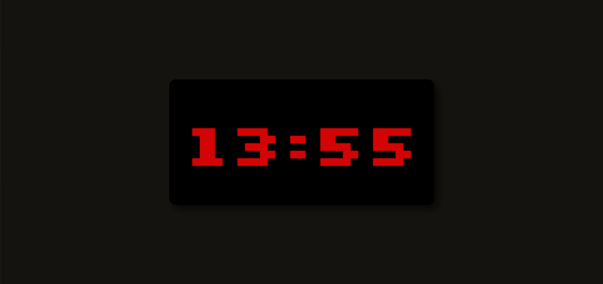

# Digital-Clock
Just a simple web digital clock made in javascript that displays current time, made for javascript training.

Live deploy:

# Technologies

- CSS flexbox and keyframes 
- media queries, variables
- Mobile responsiveness and basic interaction
- Javascript Date

# Image

